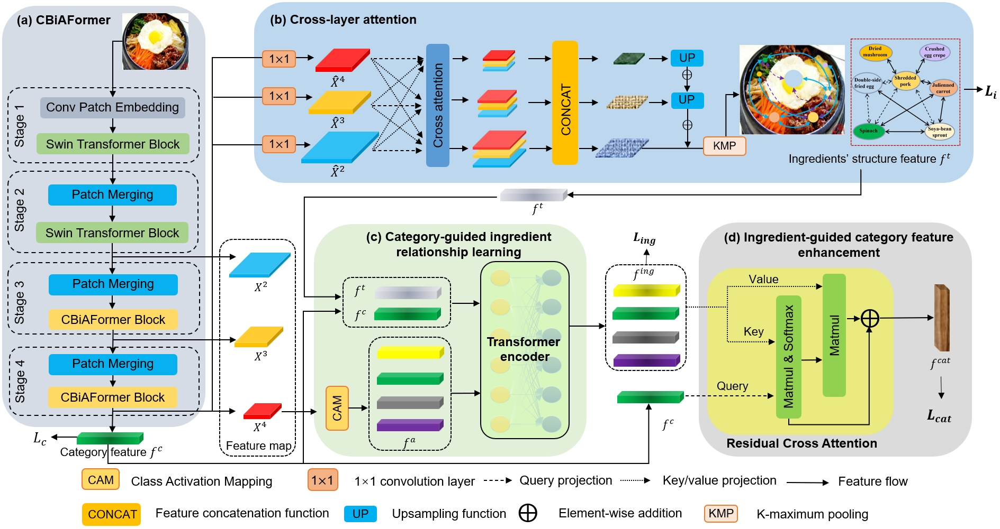
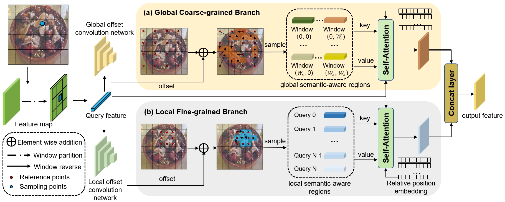

# [TIP2024] Convolution Enhanced Bi-Branch Adaptive Transformer with Cross-Task Interaction
PyTorch implementation of Convolution-Enhanced Bi-Branch Adaptive Transformer with Cross-Task Interaction for Food  Category and Ingredient Recognition [[Paper](https://ieeexplore.ieee.org/document/10471331)]

If you use the code in this repo for your work, please cite the following bib entries:

## Abstract
Recently, visual food analysis has received more and more attention in the computer vision community due to its wide application scenarios, e.g., diet nutrition management, smart restaurant, and personalized diet recommendation. Considering that food images are unstructured images with complex and unfixed visual patterns, mining food-related semantic-aware regions is crucial. Furthermore, the ingredients contained in food images are semantically related to each other due to the cooking habits and have significant semantic relationships with food categories under the hierarchical food classification ontology. Therefore, modeling the long-range semantic relationships between ingredients and the categories-ingredients semantic interactions is beneficial for ingredient recognition and food analysis. Taking these factors into consideration, we propose a multi-task learning framework for food category and ingredient recognition. This framework mainly consists of a food-orient Transformer named Convolution-Enhanced Bi-Branch Adaptive Transformer (CBiAFormer) and a multi-task category-ingredient recognition network called Structural Learning and Cross-Task Interaction (SLCI). In order to capture the complex and unfixed fine-grained patterns of food images, we propose a query-aware data-adaptive attention mechanism called Bi-Branch Adaptive Attention (BiA-Attention) in CBiAFormer, which consists of a local fine-grained branch and a global coarse-grained branch to mine local and global semantic-aware regions for different input images through an adaptive candidate key/value sets assignment for each query. Additionally, a convolutional patch embedding module is proposed to extract the fine-grained features which are neglected by Transformers. To fully utilize the ingredient information, we propose SLCI, which consists of cross-layer attention to model the semantic relationships between ingredients and two cross-task interaction modules to mine the semantic interactions between categories and ingredients. Extensive exper
iments show that our method achieves competitive performance on three mainstream food datasets (ETH Food-101, Vireo Food-172, and ISIA Food-200). Visualization analyses of CBiAFormer and SLCI on two tasks prove the effectiveness of our method.

The illustration for our framework.

The illustration for our proposed Bi-branch Adaptive Attention.

## Requirements

## Datasets and pretrained models

## Training scripts

## Pretrain scripts

## Acknowledgment
